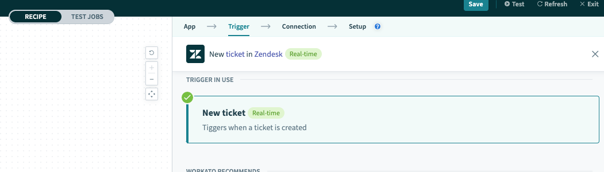
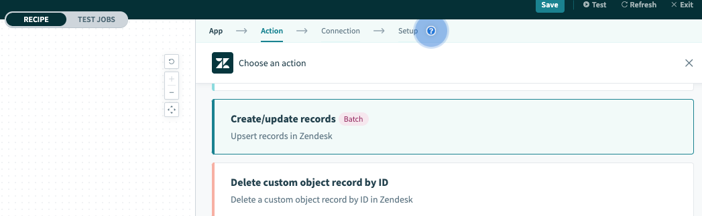
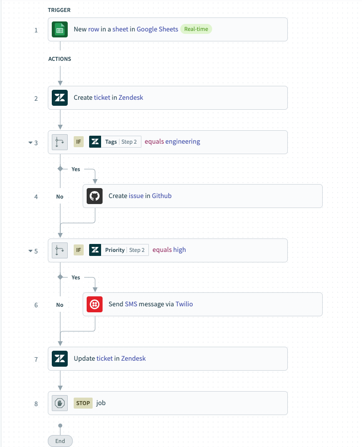
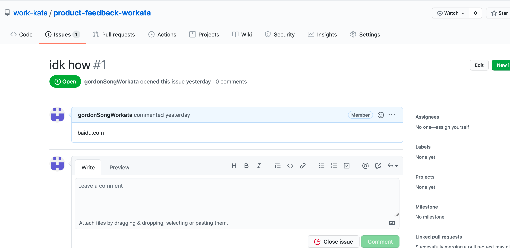
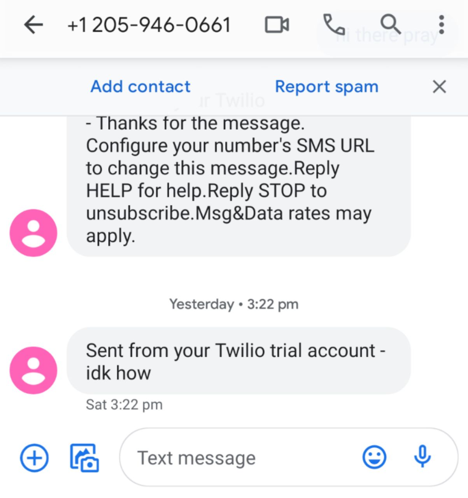

# Workato PM Take-home test (katas)

#### Kata (1): Build an action that creates a ticket in Zendesk and describe how it works
---
**Context:**
How might we go about product testing of `app.workato.com`?

***Observed bugs:***
When user is establishing trigger during recipe creation involving Zendesk, _Triggers_ seen misspelt as _Tiggers_:

When user is defining actions from Zendesk, _Update_ seen misspelt as _Upsert_:

 

#### Summary of created recipe with create Zendesk ticket action(s): ####
---
Access created recipe, `product-feedback-workata` [here](https://app.workato.com/recipes/1322460?st=13f663)

 

**How it works:**
When a QA tester finds a bug in live production, he/she will submit a google form and that will create a new row in a linked google sheets,

**Trigger:**
New row in linked google sheet. (Linked to a google form's responses).

**Actions:**
- Create a new ticket on Zendesk 
- Create the accompanying engineering issue on Github if it's tagged as `engineering`
- Send an sms through Twilio with accompaying ticket description if tagged as `high` priority
- Update the same ticket based on ticket ID to pending status

**Customizations:**
- Link your google form responses to a google sheets.
- Map `priority` data field to Zendesk's `priority`
- Create custom data field `bug category` and map to Zendesk's `subject` field
- Create custom data field `escalate to(relevant party)` and map to Zendesk's `tags` field
- Create a new custom field `base URL path` on Zendesk and include it in ticket form. Map it accordingly.

**Configurations:**
- Use basic authentication in connecting to Zendesk, Github & Twilio
- Create github organisation and corollary repository to track incoming issues
- Sign up for a trial number with Twilio
- Allow sms body to be included with Twilio

#### How it helps (detailed walkthrough): ####
---
1. As a Quality Assurance (QA) tester, I want to quickly file bugs without navigating through Zendesk Agent Support GUI but still have Zendesk tickets recorded for audit.
    + Created a [google form](https://forms.gle/NQ85DzwfA8TdJjxJ6) to capture QA's test data
    + Linked that [google form's data](https://forms.gle/NQ85DzwfA8TdJjxJ6) to [google sheets](https://docs.google.com/spreadsheets/d/1k8cHik1LTvskKfXTE76nulNHzDGWx7YaTdkbcEqwJvU/edit?usp=sharing) as Workato's connectors does not support google forms.
        - This is the `Trigger`; upon addition of google sheets row, a Zendesk ticket is created.
 

2. As a product owner, I want to extract relevant data for appropriate action by engineers and transform data meaningfully when I map it over to Zendesk.
    + Created `relevant party to escalate to` form field and map as `tags` in Zendesk.
    + Created `URL path of bug` form field and map as `bug URL path` in Zendesk.
    + Further segregrate bugs into `bug category` form field to map as `subject` in Zendesk.
 

3. As an engineer, I prefer to eliminate the step of creating the Github issue manually (with its details) on [Github organistaion's repository](https://github.com/work-kata) after viewing it on Zendesk.
    + [Github issues'](https://github.com/work-kata/product-feedback-workata/issues) title is map to `bug description` for quicker evaluation.
    + URL (mapped from Zendesk's `bug URL path`) is included in [Github issues'](https://github.com/work-kata/product-feedback-workata/issues) body for engineers to quickly reproduce bug.
    
 

4. As a product owner, I want to be alerted if the bug is feature breaking i.e. high priority
    + SMS sent if priority is high
    

5. As a data analyst, I want to customise my input data fields, extract them to google sheets and transform data via mappings to Zendesk. Zendesk serves as the single source of truth that other teams work off while the google sheets is the cleaned upstream data (shadow copy).